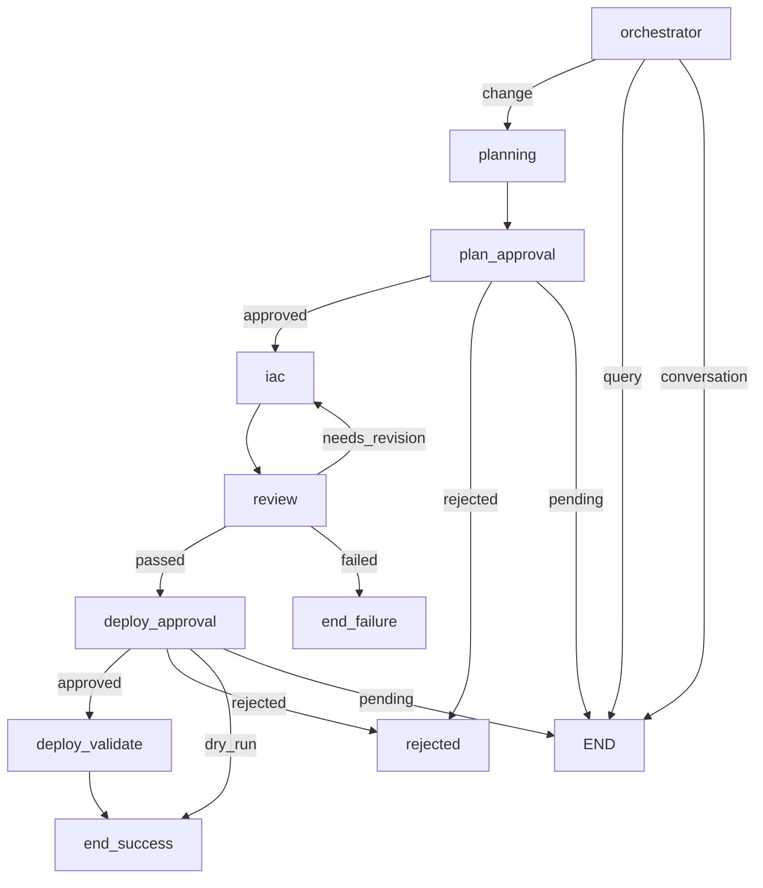

# LangGraph Workflow Reference

This document describes the LangGraph StateGraph implementation for the infra-agent 4-agent pipeline.

---

## Overview

The infra-agent uses LangGraph for orchestrating the 4-agent pipeline:

```
User Request
     │
     ▼
┌─────────────┐     ┌─────────────┐     ┌─────────────┐     ┌─────────────┐
│  Planning   │ ──▶ │    IaC      │ ──▶ │   Review    │ ──▶ │   Deploy    │
│    Agent    │     │    Agent    │     │    Agent    │     │   Validate  │
└─────────────┘     └─────────────┘     └─────────────┘     └─────────────┘
                           ▲                   │
                           │                   │
                           └───────────────────┘
                           (retry on NEEDS_REVISION)
```

---

## Source Files

```
src/infra_agent/core/
├── graph.py        # LangGraph pipeline definition
├── state.py        # PipelineState TypedDict
├── contracts.py    # Pydantic models for agent I/O
├── router.py       # Intent classification and routing
└── artifacts.py    # Artifact file management
```

---

## Pipeline State

### Source: `src/infra_agent/core/graph.py`

```python
class PipelineState(TypedDict):
    """State passed between agents in the pipeline."""

    # Core state
    request_id: str
    messages: Annotated[list[BaseMessage], add_messages]
    environment: str
    dry_run: bool

    # Agent outputs
    planning_output: Optional[PlanningOutput]
    iac_output: Optional[IaCOutput]
    review_output: Optional[ReviewOutput]
    deployment_output: Optional[DeploymentOutput]

    # Control flow
    current_agent: str
    retry_count: int
    max_retries: int  # Default: 3
    review_status: Optional[str]  # "passed", "needs_revision", "failed"

    # Approval gates
    pending_approval: Optional[str]  # "plan" or "deploy"
    cost_estimate: Optional[str]

    # Error tracking
    error: Optional[str]
```

### State Fields Explained

| Field | Type | Purpose |
|-------|------|---------|
| `request_id` | str | Unique identifier for the request |
| `messages` | list[BaseMessage] | Conversation history (uses `add_messages` reducer) |
| `environment` | str | Target environment (dev/tst/prd) |
| `dry_run` | bool | If true, skip deployment |
| `planning_output` | PlanningOutput | Output from Planning Agent |
| `iac_output` | IaCOutput | Output from IaC Agent |
| `review_output` | ReviewOutput | Output from Review Agent |
| `deployment_output` | DeploymentOutput | Output from Deploy Agent |
| `current_agent` | str | Current agent being executed |
| `retry_count` | int | Number of IaC→Review retry attempts |
| `max_retries` | int | Maximum retry attempts (default: 3) |
| `review_status` | str | Review result: passed/needs_revision/failed |
| `pending_approval` | str | Which approval is needed: plan/deploy |
| `cost_estimate` | str | Cost estimate for display |
| `error` | str | Error message if pipeline failed |

---

## Graph Definition

### Source: `src/infra_agent/core/graph.py`

```python
def get_pipeline() -> InfraPipeline:
    """Create and return the LangGraph pipeline."""

    graph = StateGraph(PipelineState)

    # Add nodes for each agent
    graph.add_node("orchestrator", orchestrator_node)
    graph.add_node("planning", planning_node)
    graph.add_node("plan_approval", plan_approval_node)
    graph.add_node("iac", iac_node)
    graph.add_node("review", review_node)
    graph.add_node("deploy_approval", deploy_approval_node)
    graph.add_node("deploy_validate", deploy_validate_node)
    graph.add_node("rejected", rejected_node)
    graph.add_node("end_success", end_success_node)
    graph.add_node("end_failure", end_failure_node)

    # Set entry point
    graph.set_entry_point("orchestrator")

    # Define edges
    graph.add_conditional_edges(
        "orchestrator",
        route_from_orchestrator,
        {
            "planning": "planning",
            "query": END,
            "conversation": END,
        }
    )

    graph.add_edge("planning", "plan_approval")

    graph.add_conditional_edges(
        "plan_approval",
        route_from_plan_approval,
        {
            "approved": "iac",
            "rejected": "rejected",
            "pending": END,  # Wait for user input
        }
    )

    graph.add_edge("iac", "review")

    graph.add_conditional_edges(
        "review",
        route_from_review,
        {
            "passed": "deploy_approval",
            "needs_revision": "iac",  # Retry loop
            "failed": "end_failure",
        }
    )

    graph.add_conditional_edges(
        "deploy_approval",
        route_from_deploy_approval,
        {
            "approved": "deploy_validate",
            "rejected": "rejected",
            "dry_run": "end_success",
            "pending": END,  # Wait for user input
        }
    )

    graph.add_edge("deploy_validate", "end_success")
    graph.add_edge("rejected", END)
    graph.add_edge("end_success", END)
    graph.add_edge("end_failure", END)

    return InfraPipeline(graph.compile())
```

---

## Node Functions

### Orchestrator Node

```python
async def orchestrator_node(state: PipelineState) -> PipelineState:
    """Entry point - classify intent and set up state."""
    messages = state["messages"]
    user_input = messages[-1].content

    # Classify intent
    intent = classify_intent(user_input)

    if intent == "change":
        # Infrastructure change - go to planning
        state["current_agent"] = "planning"
    elif intent == "query":
        # Query - handle directly
        response = await handle_query(user_input, state["environment"])
        state["messages"].append(AIMessage(content=response))
    else:
        # Conversation - respond directly
        response = await handle_conversation(user_input)
        state["messages"].append(AIMessage(content=response))

    return state
```

### Planning Node

```python
async def planning_node(state: PipelineState) -> PipelineState:
    """Generate requirements and acceptance criteria."""
    user_input = state["messages"][-1].content

    planning_agent = PlanningAgent(environment=state["environment"])
    planning_output = await planning_agent.generate_plan(user_input)

    state["planning_output"] = planning_output
    state["current_agent"] = "plan_approval"
    state["pending_approval"] = "plan" if planning_output.requires_approval else None

    # Add planning summary to messages
    summary = format_planning_output(planning_output)
    state["messages"].append(AIMessage(content=summary))

    return state
```

### IaC Node

```python
async def iac_node(state: PipelineState) -> PipelineState:
    """Implement infrastructure changes."""
    planning_output = state["planning_output"]
    review_feedback = state.get("review_output")  # On retry

    iac_agent = IaCAgent(environment=state["environment"])
    iac_output = await iac_agent.implement_changes(
        planning_output=planning_output,
        review_feedback=review_feedback,
        retry_count=state["retry_count"],
    )

    state["iac_output"] = iac_output
    state["current_agent"] = "review"

    return state
```

### Review Node

```python
async def review_node(state: PipelineState) -> PipelineState:
    """Validate IaC changes."""
    iac_output = state["iac_output"]

    review_agent = ReviewAgent(environment=state["environment"])
    review_output = await review_agent.validate_changes(iac_output)

    state["review_output"] = review_output
    state["review_status"] = review_output.status.value

    if review_output.status == ReviewStatus.NEEDS_REVISION:
        state["retry_count"] += 1

    return state
```

### Deploy Validate Node

```python
async def deploy_validate_node(state: PipelineState) -> PipelineState:
    """Execute deployment and validate acceptance criteria."""
    iac_output = state["iac_output"]
    planning_output = state["planning_output"]

    deploy_agent = DeployValidateAgent(environment=state["environment"])
    deployment_output = await deploy_agent.deploy_and_validate(
        iac_output=iac_output,
        acceptance_criteria=planning_output.acceptance_criteria,
    )

    state["deployment_output"] = deployment_output
    state["current_agent"] = "end"

    return state
```

---

## Routing Functions

### Source: `src/infra_agent/core/router.py`

### Intent Classification

```python
def classify_intent(user_input: str) -> str:
    """Classify user intent into change/query/conversation.

    Args:
        user_input: User's message

    Returns:
        "change" - Infrastructure modification request
        "query" - Status or information request
        "conversation" - General conversation
    """
    input_lower = user_input.lower()

    # Change keywords (exact word matching)
    change_patterns = [
        r'\bcreate\b', r'\bdelete\b', r'\bupdate\b', r'\bmodify\b',
        r'\bscale\b', r'\badd\b', r'\bremove\b', r'\bdeploy\b',
        r'\bprovision\b', r'\bmigrate\b', r'\bupgrade\b',
        r'\bchange\b', r'\bset\b', r'\benable\b', r'\bdisable\b',
    ]

    # Query keywords
    query_patterns = [
        r'\blist\b', r'\bshow\b', r'\bget\b', r'\bdescribe\b',
        r'\bstatus\b', r'\bcheck\b', r'\bwhat\b', r'\bhow\b',
        r'\bwhich\b', r'\bwhere\b', r'\bcount\b', r'\bfind\b',
    ]

    for pattern in change_patterns:
        if re.search(pattern, input_lower):
            return "change"

    for pattern in query_patterns:
        if re.search(pattern, input_lower):
            return "query"

    return "conversation"
```

### Route from Orchestrator

```python
def route_from_orchestrator(state: PipelineState) -> str:
    """Route from orchestrator based on intent."""
    intent = state.get("intent", "conversation")

    if intent == "change":
        return "planning"
    elif intent == "query":
        return "query"
    else:
        return "conversation"
```

### Route from Review

```python
def route_from_review(state: PipelineState) -> str:
    """Route based on review results."""
    review_output = state.get("review_output")
    retry_count = state.get("retry_count", 0)
    max_retries = state.get("max_retries", 3)

    if not review_output:
        return "failed"

    if review_output.status == ReviewStatus.PASSED:
        return "passed"
    elif review_output.status == ReviewStatus.NEEDS_REVISION:
        if retry_count < max_retries:
            return "needs_revision"  # Retry loop to IaC
        else:
            return "failed"  # Max retries exceeded
    else:
        return "failed"
```

---

## Approval Gates

### Plan Approval

Triggered when:
- `planning_output.requires_approval == True`
- Environment is PRD
- High-impact changes

```python
def route_from_plan_approval(state: PipelineState) -> str:
    """Route based on plan approval status."""
    pending = state.get("pending_approval")
    approved = state.get("plan_approved")

    if pending != "plan":
        return "approved"  # No approval needed
    elif approved is True:
        return "approved"
    elif approved is False:
        return "rejected"
    else:
        return "pending"  # Wait for user input
```

### Deploy Approval

Triggered when:
- Review passed
- Not in dry-run mode

```python
def route_from_deploy_approval(state: PipelineState) -> str:
    """Route based on deploy approval status."""
    dry_run = state.get("dry_run", False)
    approved = state.get("deploy_approved")

    if dry_run:
        return "dry_run"  # Skip deployment
    elif approved is True:
        return "approved"
    elif approved is False:
        return "rejected"
    else:
        state["pending_approval"] = "deploy"
        return "pending"  # Wait for user input
```

---

## Streaming Execution

### Source: `src/infra_agent/core/graph.py`

```python
class InfraPipeline:
    """Wrapper for LangGraph pipeline with streaming support."""

    def __init__(self, compiled_graph):
        self.graph = compiled_graph

    async def stream(
        self,
        user_input: str,
        dry_run: bool = False,
        environment: str = "dev",
    ) -> AsyncIterator[dict]:
        """Stream pipeline execution, yielding state updates."""
        initial_state: PipelineState = {
            "request_id": generate_request_id(),
            "messages": [HumanMessage(content=user_input)],
            "environment": environment,
            "dry_run": dry_run,
            "planning_output": None,
            "iac_output": None,
            "review_output": None,
            "deployment_output": None,
            "current_agent": "orchestrator",
            "retry_count": 0,
            "max_retries": 3,
            "review_status": None,
            "pending_approval": None,
            "cost_estimate": None,
            "error": None,
        }

        async for event in self.graph.astream(initial_state):
            yield event

    async def stream_with_approval(
        self,
        state: PipelineState,
        approved: bool,
    ) -> AsyncIterator[dict]:
        """Resume pipeline after approval gate."""
        pending = state.get("pending_approval")

        if pending == "plan":
            state["plan_approved"] = approved
        elif pending == "deploy":
            state["deploy_approved"] = approved

        state["pending_approval"] = None

        async for event in self.graph.astream(state):
            yield event
```

---

## Visualization

Get Mermaid diagram of the pipeline:

```python
pipeline = get_pipeline()
mermaid = pipeline.get_graph_visualization()
print(mermaid)
```

Output:



---

## Integration with CLI

### Source: `src/infra_agent/main.py`

```python
@cli.command()
@click.option("--dry-run", is_flag=True, help="Plan and review only")
def pipeline(environment: str, dry_run: bool) -> None:
    """Start LangGraph-based agentic pipeline."""

    pipe = get_pipeline()

    async def run_pipeline_session():
        while True:
            user_input = Prompt.ask("[bold blue]You[/bold blue]")

            async for state_update in pipe.stream(user_input, dry_run=dry_run):
                for node_name, node_output in state_update.items():
                    console.print(f"[bold cyan]{node_name}:[/bold cyan]")
                    # Display output...

            # Handle approval gates
            if current_state.get("pending_approval"):
                approved = Confirm.ask("Approve?")
                async for update in pipe.stream_with_approval(current_state, approved):
                    # Display output...

    asyncio.run(run_pipeline_session())
```

---

## Error Handling

### Pipeline Failures

```python
async def end_failure_node(state: PipelineState) -> PipelineState:
    """Handle pipeline failure."""
    error = state.get("error") or "Unknown error"
    retry_count = state.get("retry_count", 0)
    max_retries = state.get("max_retries", 3)

    message = f"Pipeline failed after {retry_count} retries.\n"
    message += f"Error: {error}\n"

    if state.get("review_output"):
        findings = state["review_output"].findings
        message += f"Review findings: {len(findings)} issues\n"

    state["messages"].append(AIMessage(content=message))
    return state
```

### Retry Logic

The IaC→Review retry loop:

1. IaC Agent generates changes
2. Review Agent validates
3. If `NEEDS_REVISION` and `retry_count < max_retries`:
   - Increment `retry_count`
   - Pass review feedback to IaC
   - IaC regenerates with fixes
4. If `PASSED`: Continue to deploy approval
5. If `FAILED` or max retries exceeded: End with failure
